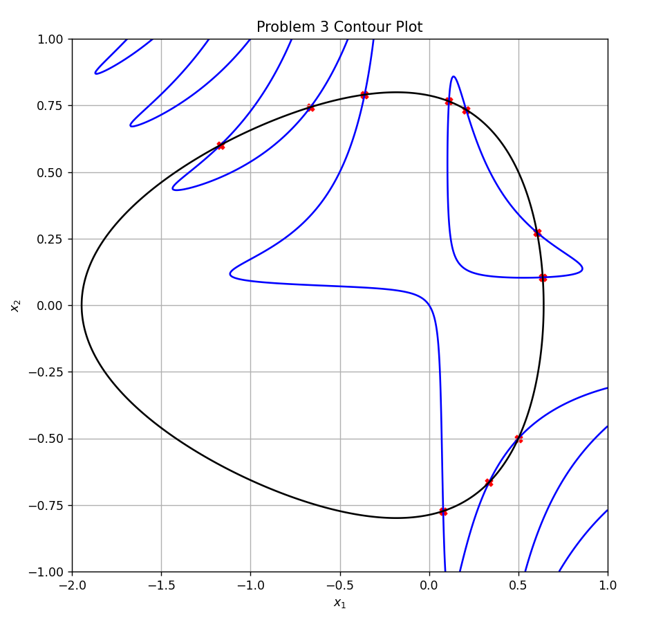

# Spiral Dynamic Inspired Optimization

Spiral Dynamic Inspired Optimization Code in Python

The algorithm can be found in:

K. Tamura and K. Yasuda, “Spiral Dynamics Inspired Optimization,” J. Adv. Comput. Intell. Intell. Inform., Vol.15, No.8, pp. 1116-1122, 2011. https://www.fujipress.jp/jaciii/jc/jacii001500081116/

and:

K. Sidarto and A. Kania, “Finding All Solutions of Systems of Nonlinear Equations Using Spiral Dynamics Inspired Optimization with Clustering,” J. Adv. Comput. Intell. Intell. Inform., Vol.19, No.5, pp. 697-707, 2015. https://www.fujipress.jp/jaciii/jc/jacii001900050697/

Tested in: Python 3.10.9 64-bit

Some of the plotting results can be found in "[**images**](<images>)" folder. For more explanation, check out the [**resume**](<Resume.pdf>)
<figure>
    
</figure>

## Animation
The animation involves the spiral dynamic motions of each randomly generated points in the domain. To run the animation, execute:

    python animation.py
    
There are several examples in "[**problems**](<problems>)" folder. To use it, change these following lines on [**animation.py**](animation.py):
`from problems.problem* import ...`
to problem's number that you want to be animated. For example:

    from problems.problem1 import ...

For initial points that are generated by using Sobol sequence, you can see it at [**anim_sobol.py**](anim_sobol.py).

To save the animation, use program from [**anim_save.py**](anim_save.py). You may need to install FFMPeg binaries from [this site](https://www.gyan.dev/ffmpeg/builds/).

## Plot
To only plot the result, execute:

    python plot.py

There are several examples in "[**problems**](<problems>)" folder. To use it, change these following lines on [**soa.py**](soa.py):
`from problems.problem* import ...`
to problem's number that you want to be animated. For example:

    from problems.problem1 import ...
